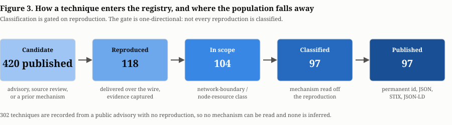

# 5. Corpus and method

All figures computed from the pinned snapshot of 2026-07-24.

## 5.1 How a technique enters the registry

The path from a candidate to a published, classified technique has four steps.

**1. Candidate identification.** A candidate arrives from a public advisory (a CVE, GHSA, or vendor security note against a node implementation), from source review of a node implementation, or from a prior technique's mechanism suggesting where else to look. This last route is what the taxonomy is *for*, and section 6 reports how much of the corpus it has produced.

**2. Reproduction.** The mechanism is reproduced against the target implementation in a controlled environment, with the attack delivered over the wire. Reproduction is the gate: a candidate that is not reproduced does not become a classified technique. It may still be published as a known technique (section 4.3), but it carries no mechanism family.

**3. Evidence capture.** The reproduction emits a bundle: the protocol-level capture, the observed effect on the target, and controlled-vocabulary provenance fields. The bundle is referenced from the instance by `bundle_ref`, so a published claim can be traced to the artefact that produced it.

**4. Instance recording, then classification.** The instance is recorded against its target with its fidelity and discovery origin. The mechanism is then read off the reproduction - what was exhausted, and which bound failed to apply - and the technique is assigned a family, surface and bound-failure mode by the procedure in section 3.4.

The registry is increment-only and the write path is gated. Public submissions are accepted into a quarantined store and never appear in any published surface until an admin-gated promotion appends them; a submission is invisible to `/techniques`, the feed, STIX, the coverage matrix and the dashboard while under review.

## 5.2 Fidelity

Every instance records how faithfully its reproduction matched the real attack, on a five-value scale: `stub`, `proxy`, `lab`, `production-derived`, `production-captured`.

The current distribution across the 199 instances on classified techniques is stark and we state it plainly:

| Fidelity | Instances |
|---|---:|
| `lab` | 198 |
| `proxy` | 1 |
| `production-captured` | 0 |
| `production-derived` | 0 |
| `stub` | 0 |

**Essentially the entire classified corpus is lab fidelity.** The attack was delivered over a real network stack against a real build of the target software, in a controlled environment. It was not captured against production infrastructure carrying real traffic, and nothing in this registry should be read as evidence about behaviour under production conditions: contention, real peer populations, operator mitigations, and CDN or load-balancer frontends are all absent. Section 8 develops what this does and does not license.

The scale exists because the distinction matters, not because the corpus spans it. It currently does not.

## 5.3 Provenance: most of this corpus reproduces public CVEs

Discovery origin is recorded per instance, on a controlled vocabulary of `original-research`, `reverse-engineered-cve` and `disclosed-advisory`. It is a distinct axis from fidelity: how a technique was *found* is independent of how faithfully it was *reproduced*.

Across the 199 instances on classified techniques:

| Discovery origin | Instances |
|---|---:|
| `reverse-engineered-cve` | 117 |
| `original-research` | 82 |

Per technique, taking the origins of all its instances together:

| | Techniques |
|---|---:|
| Reverse-engineered from public CVEs only | 72 |
| Original research only | 14 |
| Mixed | 11 |
| **Total classified** | **97** |

**Seventy-four per cent of the classified corpus is reproduction of publicly disclosed vulnerabilities.** These techniques are not discoveries. The defect was already public, generally with a CVE or GHSA identifier and often with a vendor advisory; what this work contributed was a reproduction, a captured artefact, a mechanism reading, and a place in a structured index. That is a real contribution and it is not the same contribution as finding the defect, and a reader must be able to tell which is which without inferring it.

The registry makes this checkable per technique rather than only in aggregate: `discovery_origin` is on every instance, and 358 external references (150 CVE, 152 vendor advisory, 56 GHSA) point at the original disclosures. Where a technique is original research it says so, and where it reproduces someone else's finding it says whose.

The 14 original-research techniques are a small fraction, and we do not build any claim in this paper on their being more than that.

## 5.4 What the corpus covers

**420 published techniques**, of which 118 carry at least one reproduced instance and 97 carry a mechanism family. The two counts differ by 21: 14 reproduced techniques are tombstoned as out of class (section 2.2), and 7 are reproduced, in scope, and not yet classified. Section 4.3 sets out the full reconciliation, and section 8.4 treats the 7 as a limitation.

The public dashboard's "reproduced" counter shows 104, which is 118 less the 14 tombstoned: it counts in-scope reproduced techniques, whereas this paper's headline 97 counts classified ones. Both are correct for what they measure.

The 97 classified techniques carry **199 instances across 37 distinct targets**: 33 independent chain implementations and 4 shared substrates (QUIC, HTTP/2, HTTP/3, libp2p).

The public dashboard reports 38, which is the count across all 118 reproduced techniques rather than the 97 classified ones. The extra target is IPFS, reached only by `NRDAX-T0050` (DHT Sybil content censorship), which is tombstoned as out of class. As with the 97/104/118 counts above, both figures are right for what they measure. Section 6 keeps these apart, because a mechanism recurring across independent chains and a mechanism recurring inside one shared library are different evidence.

Coverage across targets is uneven, and the shape matters more than the total:

| Target | Instances |
|---|---:|
| ethereum | 35 |
| quic | 21 |
| bitcoin | 17 |
| cosmos | 16 |
| libp2p | 13 |
| solana | 12 |
| sui | 12 |
| zcash | 12 |
| iota | 9 |
| conflux | 7 |

The top five targets hold 102 of 199 instances, and 18 of the 37 targets carry exactly one instance each. The corpus is deep on a handful of implementations and one-shot on half the rest. An absent cell in the coverage matrix therefore means "not examined" far more often than it means "not exposed", and section 8 states what follows.

By family, the classified corpus divides:

| Family | Techniques | Multi-target |
|---|---:|---:|
| `memory_amp` | 33 | 4 |
| `compute_amp` | 24 | 6 |
| `fault_termination` | 22 | 5 |
| `connection_exhaustion` | 13 | 7 |
| `response_amp` | 5 | 1 |

By bound-failure mode: `no-bound` 57, `absent-invariant` 22, `mis-quantified` 8, `late` 7, `mis-scoped` 3. The concentration in `no-bound` is worth noting as a finding about the corpus and possibly about the domain: the most common way a node's limit fails to contain an attacker-controlled quantity is that there was no limit.

By surface: P2P and gossip 50, RPC and public API 24, consensus ingest 21, sync and state import 1, control plane 1. The last two are effectively unexamined.

## 5.5 Determinism and reproducibility of the registry itself

Distinct from the reproducibility of the attacks, and worth stating because it affects what a reader can verify.

Every emitted artefact is deterministic: the same registry state produces byte-identical output, with ordering fixed by identifier rather than by row or map iteration order. The static feed, per-technique JSON, STIX export and coverage matrix are all golden-tested against a seeded fixture. Validation happens at the read boundary: a malformed published entry fails the whole build with a located error rather than yielding a partial registry, so no partially-validated state reaches a served surface.

A reader who fetches the corpus twice and diffs it sees only real change. A reader who fetches it at a stated registry version can pin exactly what they cite, subject to the DOI caveat in section 4.5.

## 5.6 One technique, end to end

Abstractions about pipelines are easier to write than to check. This is a single
technique traced through every stage, with the awkward parts left in.

**`NRDAX-T0205`, "Pre-Handshake Crypto CPU Burn".**

**Found.** Not from an advisory. Source review of Bitcoin Core's BIP-323 v2
transport showed that a 64-byte inbound `ellswift` key triggers a secp256k1
`ellswift` ECDH and an HKDF-SHA256 before any authentication or rate limit
applies, with only the soft 125-inbound connection cap gating it. Eight of the
nine instances are recorded `original-research`; the ninth is not, and is
discussed below.

**Reproduced.** The attack was delivered over a real network stack against a real
build, in a controlled environment, and the effect observed. The reproduction
artefact is `btc_bip324_prehandshake_ecdh_cpu`, and its captured evidence is
referenced from the instance by `bundle_ref`. Fidelity `lab`, which is the
ceiling for everything in this corpus (section 5.2).

**Mechanism extracted.** Read off the reproduction rather than the advisory
text, because there was no advisory. What is exhausted is CPU, so the resource
class is computation. Why the node's bound did not apply is the more useful half:
a limit exists and is enforced *after* the cost is paid. That is `late`, and the
audit question it carries is *what work happens before the first check that could
reject the input?* The pair (`compute_amp`, `late`) is the technique's cell; the
family it appears under is `compute_amp`, and `p2p-gossip` is recorded as the
surface without deciding either.

**Identified.** `NRDAX-T0205` was minted and has not changed meaning since. The
identifier encodes nothing: not the family, not the chain, not the year. When the
reclassification moved 40 techniques between families, this one's citation was
unaffected because family is an attribute rather than a component of the
identifier (section 4.1).

**Generalised.** The audit question was then asked of other implementations,
which is the taxonomy doing the work it exists for. Eight more instances
followed: Cosmos (`cometbft_mconn_handshake_burn`), Conflux, XRP, Casper, ICON,
Qtum, Polygon PoS, and libp2p. Each is a separate instance with its own
primitive, bundle and target; none is a separate technique, because the mechanism
is the same.

**Cross-referenced.** Four instances carry vendor-advisory links straight to the
implementing source: Bitcoin Core's `bip324.cpp`, CometBFT's
`secret_connection.go` at v0.38.22, `rippled`, and Qtum. The Cosmos instance
additionally carries a research brief. The libp2p instance is the one exception
to the discovery origin above: it reproduces `GHSA-876p-8259-xjgg`, an oversized
RSA key burning CPU in go-libp2p, and is recorded `reverse-engineered-cve`
accordingly. The registry states the provenance per instance rather than per
technique for exactly this reason.

**In the coverage matrix.** Nine cells across nine targets, each recording `lab`
as the strongest evidence available. Together with `NRDAX-T0100` and
`NRDAX-T0206` it forms the (`compute_amp`, `late`) cell, whose members span 18
targets between them and which was invisible under the previous scheme because
those three sat in two different families (section 6.1).

### 5.6.1 What the trace exposes

Three weaknesses are visible in this single record, and none of them is
incidental.

**Its `first_seen` is `2022-01-01`**, which is a placeholder, not a discovery
date. Section 8.6 reports that 330 of 420 techniques carry a January-1 date and
that the field will not support a temporal claim. Here is one of them.

**Its lineage is entirely uncurated.** The registry reports `independent_stacks:
0` with an upper bound of 9 and `unknown_instances: 9`. Nine deployments, and we
cannot presently say how many distinct handshake implementations they represent -
Bitcoin Core and Qtum almost certainly share one, since Qtum derives from Bitcoin
Core. The honest reading is "at least 0, at most 9", and the registry prints it
that way rather than implying nine (sections 6.1.3 and 8.4).

**Its mechanism text is written from one instance.** The stored description names
BIP-323, `ellswift` and Bitcoin Core specifically, even though the technique
spans nine targets and the CometBFT and XRP instances exercise different
handshakes reaching the same defect. The field should state the mechanism
implementation-independently and instead reads as a description of the first
instance found. That is a data-quality defect in the corpus, not in the
classification, and it is one we have not fixed.
